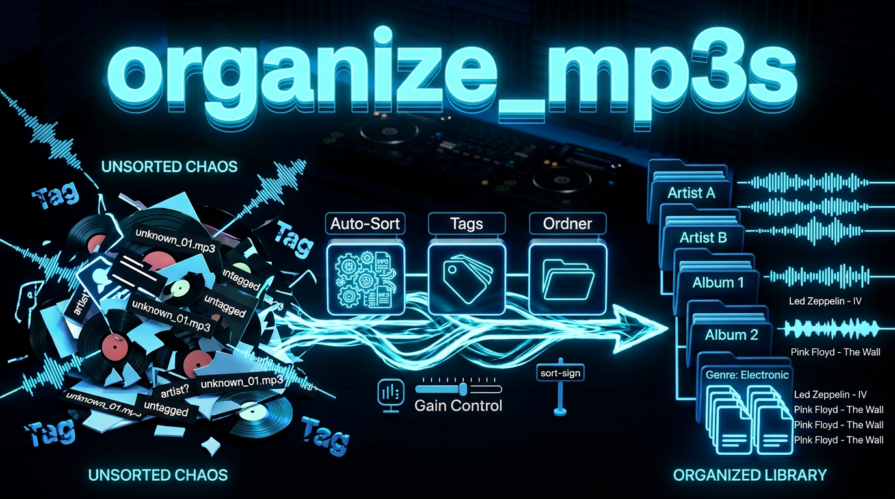

# MP3/M4A Organizer




[](https://github.com/holgerkampffmeyer2/organize_mp3s)
[](https://github.com/holgerkampffmeyer2/organize_mp3s)

AI-agent driven MP3/M4A organization with online genre lookup, metadata-based sorting, and configurable destination mapping. Designed to be controlled by AI coding assistants like [opencode](https://opencode.ai) or Claude Code.

## How It Works

An AI agent reads `AGENT.md` and executes the organization workflow:

```
AI Agent reads AGENT.md → Pre-flight Check → Executes organize_music.py → Monitors results → Verifies output
```

The agent handles:
- Prerequisites check (ffmpeg, python3)
- File discovery and batch processing decisions
- Metadata extraction from files
- Online genre lookup: iTunes → Bandcamp → MusicBrainz
- Online label lookup: iTunes (when metadata missing), Bandcamp fallback
- Error recovery and retries
- Verification of organization results

## Usage

### Via AI Agent (Recommended)

Open an AI coding assistant in this directory and prompt:

```
Organize all MP3 and M4A files using the workflow from AGENT.md.
```

### Via Command Line

```bash
# Normal mode (actually moves files)
python3 organize_music.py [source_directory]

# Dry-run mode (only shows what would be done, no files moved)
python3 organize_music.py --dry-run [source_directory]
# or
python3 organize_music.py -n [source_directory]

# Metadata enrichment mode (enriches missing metadata tags from online sources)
python3 organize_music.py --enrich-metadata [source_directory]
# or
python3 organize_music.py -e [source_directory]
```

- `source_directory`: The directory to scan for audio files (defaults to current directory if not provided).
- The script will create `organization_results.json` (normal mode) or `organization_audit.json` (dry-run) in the source directory.

## Prerequisites

```bash
sudo apt update
sudo apt install ffmpeg python3
```

## Technical Details

- **Metadata Source**: Artist and title from file metadata (single ffprobe call); Label from file metadata or online lookup
- **Genre/Label Lookup**: iTunes Search API (primary, single unified call), Bandcamp (fallback), MusicBrainz (tags)
- **Label Lookup**: iTunes Search API (when metadata missing, with track ID lookup), Bandcamp fallback
- **Sorting Priority**: Label mapping first, then Genre mapping as fallback
- **Early-Exit Optimization**: When label already maps to destination, genre lookup is skipped (saves API calls)
- **Subgenre Hierarchy**: Subgenres automatically map to parent genres (e.g., "Electro House" → "House")
- **Fuzzy Genre Matching**: Configurable threshold (default 0.6) with 30+ genre synonyms (e.g., "hip hop" → "Hip-Hop/Rap", "dnb" → "Drum n Bass")
- **Metadata Mismatch Detection**: Compares metadata artist/title against filename using fuzzy matching. When mismatch detected (similarity < 0.6), uses filename values for online lookups instead of wrong metadata. Mismatch details logged with similarity scores and included in result JSON.
- **Metadata Enrichment**: Optional feature to write missing metadata (label, genre, album, year) from online sources back to audio files (via CLI `--enrich-metadata` or config `enrich_metadata: true`)
- **Move Control**: Configurable `move: true|false` option to enable/disable file movement (default: true). When `move: false`, the script determines destinations but doesn't move files.
- **Execution Order**: 1) dry-run check, 2) metadata enrichment (if enabled), 3) file movement (if enabled)
- **Timeouts**: 5 seconds for ffprobe (single call), 10 seconds for HTTP requests
- **Output**: Files moved to genre-specific or label-specific folders as defined in config.json
- **Logging**: JSON log of non-processed files (normal) or audit log (dry-run)
- **Caching**: In-memory cache for online lookups to avoid repeated API calls

## Configuration

Create a `config.json` file in the same directory as the script:

```json
{
  "genre_map": {
    "Drum n Base": "/path/to/drum-n-base",
    "House": "/path/to/house",
    "Techno, Trance": "/path/to/electronic"
  },
  "label_map": {
    "Ninja Tune": "/path/to/ninja-tune",
    "Warp Records": "/path/to/warp",
    "Planet Mu": "/path/to/planet-mu"
  },
  "label_source_tag": "label",
  "fuzzy_threshold": 0.8,
  "enrich_metadata": false,
  "move": true
}
```

- Add more genres or labels as needed.
- The `label_map` works the same way as `genre_map` (keys can be comma-separated lists).
- If `label_source_tag` is provided, the script will try to read that specific tag (and its uppercase variant) for the label.
- If `label_source_tag` is not provided, the script checks common label-related tags: 'label', 'Label', 'TPUB', 'publisher'.
- **Subgenre Support**: Subgenres like "Electro House", "Progressive House", "Dance", "Electronic" automatically map to "House" if configured.

## File Structure

```
organize_mp3s/
├── AGENTS.md          # AI agent workflow instructions (this file)
├── README.md          # This file
├── organize_music.py  # Python organizer script
├── config.json        # Genre to folder mapping
├── tests/             # Unit tests
│   ├── __init__.py
│   └── test_organize_music.py
├── *.mp3              # Source MP3 files
├── *.m4a              # Source M4A files
└── organization_*.json # Log files (generated)
```

## For AI Agents

See [AGENTS.md](AGENTS.md) for complete workflow instructions including:
- Pre-flight Check
- Execution steps
- Result verification

## License

MIT

---

**Holger Kampffmeyer** (DJ Hulk)

- Website: [holger-kampffmeyer.de](https://holger-kampffmeyer.de)
- Email: holger.kampffmeyer+dj@gmail.com
- Instagram: [@djhulk_de](https://instagram.com/djhulk_de)
- YouTube: [@djhulk_de](https://youtube.com/@djhulk_de)
- Mixcloud: [holger-kampffmeyer](https://mixcloud.com/holger-kampffmeyer)
- LinkedIn: [holger-kampffmeyer](https://linkedin.com/in/holger-kampffmeyer-390b6789)


**Note**: This tool is designed to be used with AI coding assistants but can also be run manually via the command line.